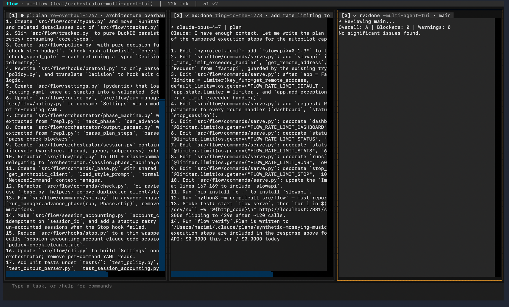

# `flow`

**A terminal control room for Claude Code.** Type tasks, watch agents work in parallel, drill into any session.



Three sessions above: a planner mapping out an architecture overhaul, an executor that just shipped rate limiting, and a reviewer that auto-spawned after the ship — all running simultaneously without any coordination on your part.

---

## Why

Plain `claude` is one session, no cost visibility, no automatic path to a PR. `flow` adds all of that:

- **Parallel sessions** — each task runs in its own git worktree and branch, no file conflicts
- **Live control room** — all sessions visible at once, each streaming output in real time
- **Three session types** — executor (full pipeline), planner (interactive), reviewer (one-shot diff review)
- **Drill-down** — `/view N` opens a session's full stream with a live input line to inject messages
- **Auto-pipeline** — verify → fix → code review → ship → reviewer auto-spawned; no manual gates
- **Cost always visible** — token quota and API spend in the header, updated every 5 seconds
- **Hard limits via hooks** — step budgets, bash allowlist, agent spawn gates enforced at the hook layer

---

## Install

```sh
pip install -e .
flow init
```

`flow init` writes hooks into `~/.claude/settings.json` and creates `~/.autopilot/.env`:

```sh
ANTHROPIC_API_KEY=sk-ant-...   # for utility calls (ship, ci-review, check)
AP_PLAN=pro                    # claude.ai plan: pro | max5 | max20 | api_only
```

---

## Usage

```sh
flow
```

Type a task and press Enter. A session starts in a new git worktree and branch. Type another while the first is running — they run in parallel.

### Session types

| Prefix | Type | Model | Behavior |
|---|---|---|---|
| _(none)_ | executor | sonnet | Plan → execute → verify → ship → reviewer spawned |
| `plan: <question>` | planner | opus | Interactive: waits for your replies via `/view N` |
| `review: <branch>` | reviewer | haiku | One-shot: diffs the branch and reports findings |

```
plan: how should we structure the auth layer?
add rate limiting to the API endpoints
review main
```

### Drill-down

`/view N` opens a session's full output stream. Type to inject a message (useful for planners waiting for your input — shown with `?` in the pane title).

### Slash commands

| Command | Effect |
|---|---|
| `/view N` | Open session N's full output stream |
| `/stop [N]` | Stop session N, or all running sessions |
| `/prompt N <msg>` | Inject a message into session N from the main view |
| `/model opus\|sonnet\|haiku` | Force model for new sessions |
| `/no-agents` | Toggle subagent spawning |
| `/budget $X` | Set API spend cap |
| `/resume [run_id]` | Attach to an interrupted run |
| `/quit` | Exit and clean up completed worktrees |

---

## CLI — scripting and CI

These run outside the TUI, for scripts and CI pipelines.

```sh
flow init                        # wire hooks, create .env
flow doctor [--fix]              # check hook health
flow stats [--project foo]       # cost breakdown by project
flow ship                        # verify → commit → PR (manual)
flow check                       # AI code review on local diff
flow resume [run-id]             # resume interrupted run
flow ci-review --pr 42           # AI review for GitHub Actions
flow ci-review --diff path/to/file.diff
```

---

## Auto-pipeline

Executor sessions run the full pipeline automatically:

```
plan → execute → verify → (fix loop, max 2) → code review → ship → reviewer spawned
```

Configure in `constraints.yaml`:

```yaml
auto_verify_on_steps_complete: true
auto_check_before_ship: true
auto_remediate: true
auto_remediate_max_tries: 2
```

## Agent spawn policy

`constraints.yaml` sets `agent_spawn_policy: smart` by default:

| Condition | Decision |
|---|---|
| Read-only tools only | Always allowed |
| Write-capable, spend < 50% of gate | Allowed |
| Write-capable, spend ≥ 50% of gate | Allowed in execute phase only |
| Write-capable, spend ≥ gate | Blocked |

---

## Prerequisites

- [Claude Code](https://claude.ai/code) installed and authenticated
- Python 3.9+
- [`gh`](https://cli.github.com) CLI (for `flow ship` and CI review)
- A GitHub repo with `origin` set
- An Anthropic API key (for utility calls)
