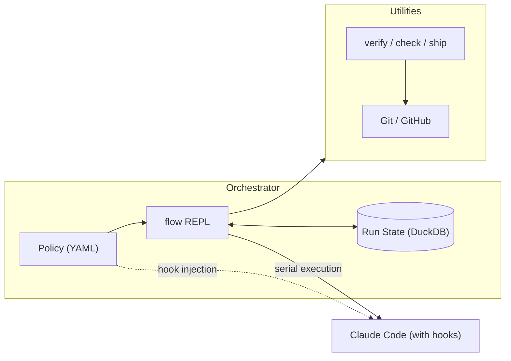
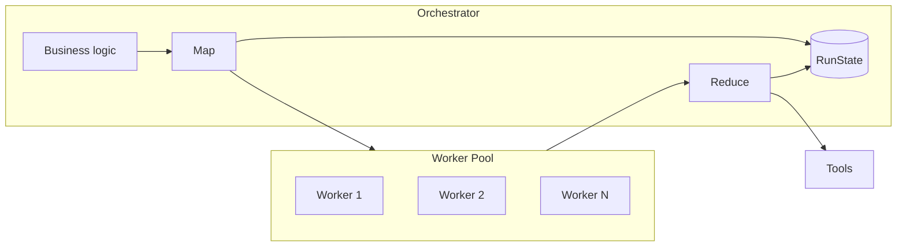

# `flow`

**Cost-aware, model-agnostic CLI orchestrator for bounded LLM development workflows.**

`flow` wraps any LLM coding agent as a supervised worker: it owns phase transitions, persisted `RunState`, hook-enforced spend and step limits, and the utility calls (verify, check, ship, review) that sit outside the model session. The model is a worker inside that loop — not the whole system. Claude Code is the first worker; others can be plugged in.

**Happy path:**  
`prompt → patch → PR → review → merge`

---

## Why

Running LLM coding sessions without a harness means:

- **No cost visibility** — API spend is opaque
- **No model discipline** — tasks default to expensive models
- **No bounds** — subagent spawning + context bloat + runaway sessions
- **No workflow** — PR/review/ship are manual

---

## How it works

```
flow (orchestrator) → Claude Code worker session (hooks) → flow verify | flow check | flow ship → CI / review
```

Three properties enforced by the harness, not the model:

| Property | Mechanism |
|---|---|
| **Cost-aware** | Two billing surfaces tracked separately (subscription quota + API USD); spend gate blocks utility calls over budget |
| **Model-agnostic** | Any LLM worker can be plugged in — the orchestrator's phases, briefings, and constraints are model-independent; Claude Code is the current worker, others are planned |
| **Bounded** | Weighted step budgets per phase, bash allowlist, subagent spawn gate, context compression on `/new` |

The **host** owns state and policy; the **worker** is one headless Claude Code turn under hooks; utilities run outside the model process and cannot be bypassed.

State lives in an explicit **RunState machine** backed by DuckDB, not Claude's chat history. Every session gets a structured briefing injected so context stays cheap, runs are resumable, and cost is attributable per run.

Phases: `plan → execute → verify → ship`. Each phase enforces its own step budget and selects the appropriate model (currently Opus / Sonnet / Haiku within Claude). The briefing format and constraint layer are model-independent.

### Scaling

**Today:** One serial worker per run.



**Target:** Parallel workers; 2 scaling modes. ([Map/reduce design](docs/ENGINEERING.md#map-reduce-scaling-path))



---

## Prerequisites

- [Claude Code](https://claude.ai/code) CLI installed and authenticated (`claude login`)
- Python 3.9+
- [`gh`](https://cli.github.com) CLI (for `flow ship` and the GH Actions reviewer)
- A GitHub repo with a remote set as `origin`
- An Anthropic API key (for flow utility calls only — `flow ship`, `flow ci-review`, `flow check`)

---

## Install

```sh
pip install -e .
flow init
```

`flow init` writes hooks into `~/.claude/settings.json` and creates `~/.autopilot/.env`. Fill in your keys:

```sh
ANTHROPIC_API_KEY=sk-ant-...         # for flow utility calls (ship, ci-review, check)
AP_PLAN=pro                          # claude.ai plan: pro | max5 | max20 | api_only

LANGFUSE_PUBLIC_KEY=pk-lf-...        # optional
LANGFUSE_SECRET_KEY=sk-lf-...        # optional

AP_DB_PATH=~/.autopilot/costs.duckdb # optional — override DuckDB location
AP_BUDGET_USD=1.00                   # optional — override API spend gate (default: $1.00)
```

If `flow` isn't found after install:

```sh
echo 'export PATH="$HOME/Library/Python/3.9/bin:$PATH"' >> ~/.zshrc && source ~/.zshrc
```

---

## Usage

### Interactive REPL

```sh
flow
```

Type a task in natural language. Flow runs a short intake, then runs Claude Code headlessly (`claude -p`). Each turn is one bounded agentic pass; the same session is **resumed** on the next message until you `/done`. Hooks only fire on `flow`-launched subprocesses — a normal `claude` session elsewhere is unaffected.

```
flow [plan:sonnet|step:0/30|wt:0.0|api:$0.00|quota:3/45] > add JWT authentication to the API

Quick intake — press Enter to skip any field.
  Acceptance criteria: …

→ Claude headless (claude-opus-4-7) | phase: plan | run: a3f2b1c4
```

### Slash commands

| Command | Effect |
|---|---|
| `/plan` | Switch to Opus (planning phase) |
| `/exec` | Switch to Sonnet (execution phase) |
| `/fast` | Switch to Haiku (quick tasks) |
| `/model opus\|sonnet\|haiku` | Force a specific model |
| `/no-agents` | Toggle subagent spawn blocking |
| `/budget $X` | Set API spend gate |
| `/new` | Compress context, start fresh session with RunState injected |
| `/compact` | Same as `/new` |
| `/resume [run_id]` | Resume an interrupted run |
| `/skip-plan` | Skip planning, go straight to execute |
| `/approve` | Approve captured plan and start execute turn |
| `/reject` | Clear captured plan, stay in plan |
| `/next` / `/step-done [id]` | Mark plan step done |
| `/gate plan on\|off` | Toggle plan approval gate |
| `/gate pr on\|off` | Toggle PR approval gate |
| `/gate autoship on\|off` | Auto-run `/ship` after `/verify` passes |
| `/ship-branch <name>` | Set branch name override for `/ship` |
| `/ship-title <title>` | Set PR title override for `/ship` |
| `/verify` | Run tests/lint for current project |
| `/check` | Run independent diff checker |
| `/ack-check` | Acknowledge checker blockers so `/ship` can proceed |
| `/ship` | Verify → commit → create PR |
| `/done` | Mark current run complete |
| `/status` | Show quota window + API spend + run state |
| `/quit` | Exit |
| `/help` | Show all slash commands |

### CLI commands

```sh
flow                     # launch interactive REPL
flow status              # quota window + API spend today + active run
flow stats               # usage breakdown by project
flow stats --project foo # filter by project
flow route "review PR"   # recommend model tier for a task description
flow verify              # run tests/lint for the current project
flow check               # independent reviewer on git diff HEAD (optional --json)
flow ship                # verify → AI commit message → git commit → AI PR description → gh pr create
flow ship --branch-name feat/my-name --pr-title "My PR title"
flow resume [run-id]     # resume an interrupted run
flow serve               # local dashboard on :7331
flow serve --port 8080
flow ci-review --pr 42   # AI code review for a PR (used by GitHub Actions)
flow ci-review --diff path/to/file.diff
flow features list       # list feature state from features.yaml
flow features add F01 "POST /x returns 201" --verify "pytest tests/test_x.py -x"
flow features pick       # set one active feature (WIP=1)
flow features verify     # run active feature verification and mark passing/blocked
```

---

## Phase routing

| Phase | Model | When |
|---|---|---|
| Plan | `claude-opus-4-7` | Architecture, design, first session on a task |
| Execute | `claude-sonnet-4-6` | Implementation once a plan exists |
| Fast / CI | `claude-haiku-4-5-20251001` | Quick questions, lightweight tasks |

Keyword overrides (scanned before phase routing):

| Keyword | Model |
|---|---|
| `architecture`, `design` | Opus |
| `refactor`, `review`, `test`, `fix` | Sonnet |
| `quick`, `explain` | Haiku |

Override at any time with `/model` or by editing `routing.yaml`.

---

For engineering principles, constraint details, observability design, billing surfaces, and the style system, see [ENGINEERING.md](docs/ENGINEERING.md).
